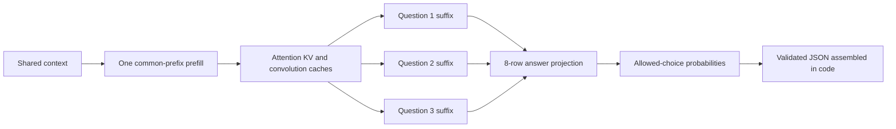

# Decision Lab

**An experiment in small language models that make typed decisions without generating JSON token by token.**

Give it a shared context and several questions. It scores the allowed answers,
then ordinary code assembles the result. The current prototype uses a fine-tuned
350M model and runs locally in a WebGPU browser or Python.

This is a **concept and research experiment**. It is inspired by Jev's typed
decision interface, independently implemented, and unaffiliated with Jev or
TypeSafe. It does not reproduce their private model or training recipe.

**The central finding:** the prototype is fast, but broad decision quality is
still weak. It gets **83.0%** on a held-out public-task test and only **59.6% of
fields / 19.0% of complete records** on our known Jev-style workflow suite.
Those are different tests, not interchangeable measures of reliability.

[How it works](docs/ARCHITECTURE.md) · [Results](docs/RESULTS.md) ·
[SDK](sdk/README.md) · [Training](docs/TRAINING.md) ·
[Contributing](CONTRIBUTING.md) · [Downloads](https://github.com/khalilelghoul01/decision-lab/releases)

[Short explanation to share](docs/EXPLAINER.md).

## The idea in one minute

A regular generative model emits `{`, a key, punctuation, a value, and so on.
That takes a sequence of output-token steps. If an application only needs a
small set of decisions, we can ask a simpler question:

> Can a small adapted language model score the allowed answers directly?

Decision Lab does this:

1. Compile each field into a question and 2–8 choices, mapped to the single tokens A–H.
2. Tokenize the prompts and find their common prefix containing the shared context.
3. Process that prefix once and retain the model's attention and convolution states.
4. Process the independent question suffixes in small batches, reusing that state.
5. Project each final hidden state through **eight trained answer-token rows**.
6. Mask unused choices, apply a calibrated softmax, and assemble typed JSON in code.



This is **one prefill plus suffix processing**, not one total forward pass.
The runtime compiles the request into questions; it does not paste the whole
JSON schema into every prompt. No output tokens are sampled. Fields are
independent, so valid JSON can still contain wrong or inconsistent decisions.

## Try the browser demo

Requires Node.js 20+ and a browser with WebGPU and `shader-f16`. Use localhost or HTTPS.

```sh
git clone https://github.com/khalilelghoul01/decision-lab.git
cd decision-lab

# Downloads the released INT4 artifact, checks its SHA256, and extracts it.
python3 scripts/download_model.py

cd sdk
npm ci --ignore-scripts
npm run build
cd ../browser
npm ci --ignore-scripts
npm run dev
```

Open the printed local URL. `/sdk.html` is the model loader and SDK example;
the main page includes reference-parity checks and the known workflow suite.
The first model load downloads roughly **296 MB of weights**. Warm inference
is much faster than downloading/loading the model or compiling shaders.
The server serves static files; prompts are processed locally in the browser.

For a ready-built version, download `decision-lab-browser-demo.zip` from
[Releases](https://github.com/khalilelghoul01/decision-lab/releases), extract it,
run `python3 -m http.server 8000 --bind 127.0.0.1` in that directory, and open
`http://localhost:8000/sdk.html`.

## Small TypeScript SDK

The SDK is in this repository and as an npm-installable tarball in Releases.
It has not been published to the npm registry. Model weights are separate.

```ts
import {loadModel, choice, noul, score} from 'decision-lab-sdk';

const model = await loadModel({modelUrl: '/model-v3-q4'});

const result = await model.systemOne({
  state: 'The plot was awful, but the acting was excellent.',
  questions: {
    good_acting: noul('Was the acting good?'),
    topic: choice('What is this text about?', {Movies: null, Sports: null}),
    quality: score('How good was the acting?', ['Bad', 'Mixed', 'Good']),
  },
});

console.log(result.answers.good_acting.noul); // P(yes), between 0 and 1
console.log(result.answers.topic.choice);    // a typed allowed label
console.log(result.answers.quality.score);   // expected ordinal index, 0–2

await model.dispose();
```

Copy the ONNX support files with `npx decision-lab-assets public/ort` when using
the SDK in your own app. [Complete setup and API](sdk/README.md).
The loader supports file download progress, cancellation, browser caching,
queued inference, explicit errors, and GPU cleanup.

## What was measured

The released model is based on [LiquidAI/LFM2.5-350M](https://huggingface.co/LiquidAI/LFM2.5-350M):
16 hybrid layers, with six attention and ten convolution blocks. We trained
rank-16 LoRA adapters and a small answer head, using supervised cross-entropy.
This project does **not** claim to implement RLCD.

| Measurement | Result |
| --- | ---: |
| Public held-out test, INT4, two option orders | **83.00%** on 1,600 examples |
| Same public test, FP16 | 83.13% |
| Same public test, unadapted 350M baseline, two orders | 60.88% |
| Generated exercises, INT4 | 99.13% on 1,600 examples |
| Known workflow regression, actual WebGPU | **143/240 fields; 16/84 exact records** |
| Valid JSON for accepted workflow cases | 84/84 |
| Warm four-field browser request, one order | **92 ms** |
| Warm four-field browser request, two orders | **148 ms** |
| Released weight file | 296 MB |

Timing: Apple M4 Mac mini, 16 GB, median of five warm requests including
tokenization and response assembly. Loading and shader compilation are excluded.
Public INT4 accuracy used the exported ONNX model on CPU; WebGPU was separately
checked against it and on the workflow suite. The SDK extraction subsequently
measured a 145 ms median on the same four-field request.

Generated tests share generator logic with training. The 84 workflow cases
were previously inspected. Neither is an independent production benchmark.
There is no head-to-head measurement against the real Jev API.
[Methodology, per-task scores and mistakes](docs/RESULTS.md).

## Data and training

- **205,058 labeled field decisions:** 199,058 train, 1,200 development,
  1,600 calibration, and 3,200 final test.
- Eight public task families and eight generated policy/decision families.
- Public annotation provenance is preserved; generated labels come from explicit rules.
- Splits have no exact normalized-context overlap. This does not prove semantic deduplication.
- A bounded Colab T4 run completed 3,200 updates; development selected step 2,800.
  That selected checkpoint saw 61,521 unique examples, not the entire training set.
- A separate calibration split fitted temperature. Final-test labels were excluded
  from training and checkpoint selection.

[Dataset card and source terms](docs/DATASET.md) ·
[Reproduce the pipeline](docs/TRAINING.md) ·
[Frozen experiment plan](docs/TRAINING_PLAN.md).

## Limits and useful next steps

The release accepts **1–32 questions**, **2–8 choices or score levels**, and
**1,024 tokens per complete field prompt**, including context and question text.
The upstream backbone supports a longer context, but this trained/exported
experiment is validated only at its current 1,024-token limit.

It cannot produce arbitrary free-text extractions. Independent fields can
contradict each other. Choice/Score confidence is an entropy-derived measure,
not P(correct). Noul means P(yes), not certainty. Calibration is limited to the
evaluated distribution, and high-confidence errors remain. Prompt-injection
stress results are weak. Use it as an experiment, not an authority for decisions
with real consequences.

Contributions that would help most:

- Fresh, independently labeled workflow evaluations and failure analysis.
- Better task data, counterexamples, and controlled training ablations.
- Calibration and abstention on new domains.
- Cross-field consistency and longer-context evaluation.
- Profiling, lower-memory loading, and broader browser/device tests.

[Contribution guide](CONTRIBUTING.md) · [Roadmap](docs/ROADMAP.md).

## Repository map

| Path | Purpose |
| --- | --- |
| `sdk/` | TypeScript loader, typed API, shared runtime and tests |
| `browser/` | Playground and loader example |
| `decision_v3.py` | Training and native policy |
| `decision_engine.py`, `portable_model.py` | Shared-cache native and ONNX implementations |
| `build_v3_data.py`, `v3_synthetic.py` | Dataset construction |
| `evaluate_v3.py`, `validate_quantized.py` | Calibration and evaluation |
| `protocol/`, `examples/`, `evals/` | Contracts, examples and known regression cases |
| `reports/` | Recorded aggregate results, configuration and audits |
| `docs/` | Architecture, methodology and contribution directions |

`decision_lab.py` and `decision_v2.py` retain earlier research utilities and
baseline compatibility; V3 is the documented release path.
Large generated data and checkpoints are excluded from Git history.

## License and attribution

Original project **source code is MIT licensed**. Model weights and derivative
model artifacts retain the separate [LFM Open License](licenses/BASE_MODEL_LICENSE),
including its commercial-use conditions; they are not relicensed as MIT.
Public datasets retain their individual upstream licenses. See [NOTICE](NOTICE.md).

The typed decision interface was inspired by Jev. The backbone is from Liquid AI;
the runtime uses Hugging Face Transformers, PEFT, and ONNX Runtime. This repository
documents one implementation and its limitations, not a claim of architectural
novelty or a reproduction of anyone's proprietary system.
