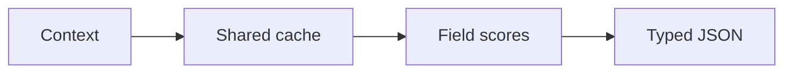

# Decision Lab

**A small model that scores decisions and returns typed JSON, without generating output token by token.**

An open research experiment built on a fine-tuned 350M model. It runs locally
in a WebGPU browser or Python. Inspired by Jev's typed decision interface;
independently implemented and unaffiliated with Jev or TypeSafe.

[Try it](#try-it) · [How it works](docs/ARCHITECTURE.md) ·
[Results](docs/RESULTS.md) · [SDK](sdk/README.md) ·
[Contribute](CONTRIBUTING.md) · [Documentation](docs/README.md)

## How it works

1. Turn each field into a question with a fixed set of allowed answers.
2. Process the shared context once and cache the model's state.
3. Score each question's answers while reusing that cache.
4. Convert scores to probabilities and assemble JSON in code.



The runtime supports **Choice** (a label), **Noul** (P(yes)), and **Score**
(an expected ordinal index). It uses one prefill plus question processing,
not one total forward pass. Valid JSON does not guarantee correct decisions.
[Detailed architecture](docs/ARCHITECTURE.md) · [Short explanation to share](docs/EXPLAINER.md)

## Try it

Requires Node.js 20+, Python 3.12+, and a browser with WebGPU and `shader-f16`.

```sh
git clone https://github.com/khalilelghoul01/decision-lab.git
cd decision-lab
python3 scripts/download_model.py
npm --prefix sdk ci --ignore-scripts
npm --prefix sdk run build
npm --prefix browser ci --ignore-scripts
npm --prefix browser run dev
```

Open the printed URL. `/sdk.html` shows the model loader. Prompts stay local;
the first load includes roughly **296 MB of weights** and shader compilation.

Prefer a ready-built demo? Download `decision-lab-browser-demo.zip` from
[Releases](https://github.com/khalilelghoul01/decision-lab/releases/tag/v0.1.0),
extract it, and run `python3 -m http.server 8000 --bind 127.0.0.1` inside the folder.
Open `http://localhost:8000/sdk.html`.

## Current results

This is a **concept and experiment**, with substantial accuracy limits.

| Measurement | Released INT4 model |
| --- | ---: |
| Held-out public tasks, 1,600 examples | **83.0%** accuracy |
| Known workflow suite, 240 fields / 84 records | **59.6%** fields / **19.0%** exact records |
| Warm four-field browser request, one / two option orders | **92 / 148 ms** |

Timing is the median of five warm runs on an M4 Mac mini with 16 GB, excluding
loading. Public-task accuracy was measured on ONNX CPU; workflow accuracy on
actual WebGPU. The workflow suite is a known regression set, not a blind test.
[Full methodology, baselines and failures](docs/RESULTS.md).

The current limit is **32 questions**, **2–8 choices per question**, and
**1,024 tokens per complete field prompt**. Fields are independent and can
contradict each other. Confidence is not a guarantee of correctness. Training
uses supervised cross-entropy plus calibration; this release does not implement RLCD.

## Find your way around

| Directory | Purpose |
| --- | --- |
| [sdk/](sdk/) | TypeScript model loader and typed API |
| [browser/](browser/) | Playground and SDK demo |
| [python/](python/) | Native runtime, training, export and tests |
| [docs/](docs/) | Architecture, results, dataset and training guides |
| [research/](research/) | Frozen evaluation evidence and regression fixtures |
| [examples/](examples/) | Sample requests and schemas |
| [scripts/](scripts/) | Verified model downloads and release tools |

Independent evaluation cases, better training data, calibration, and browser
performance work are welcome. [Contribution guide](CONTRIBUTING.md).

## License

Original source is **MIT**. Model weights retain the separate
[LFM Open License](licenses/BASE_MODEL_LICENSE); public datasets retain their
upstream terms. [Attribution and notices](NOTICE.md).
